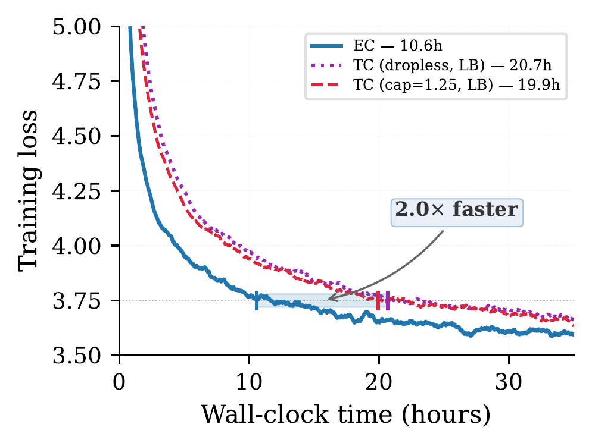
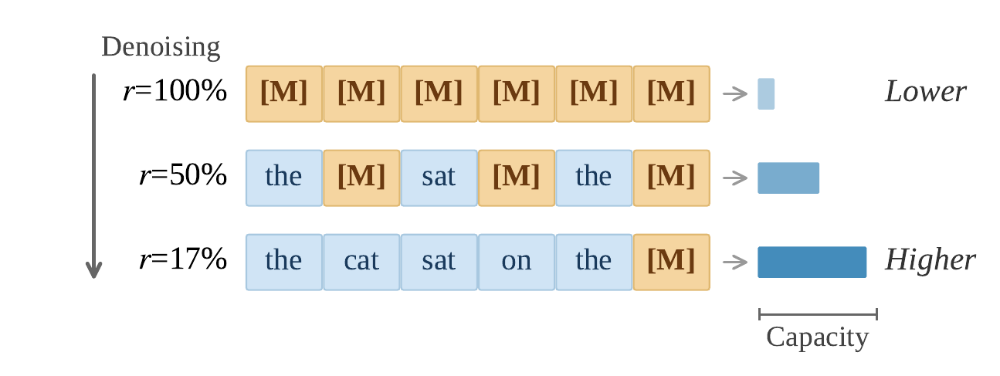

# Expert-Choice Routing Enables Adaptive Computation in Diffusion Language Models

Official code for the paper *"Expert-Choice Routing Enables Adaptive Computation in Diffusion Language Models"*. [[arXiv]](https://arxiv.org/abs/2604.01622)

We show that **expert-choice (EC) routing is a better fit for DLM MoE models** than token-choice (TC) routing: EC provides deterministic load balancing by design, yielding **2x faster wall-clock convergence** and higher throughput. We further introduce **timestep-dependent expert capacity scheduling**, where allocating more capacity to low-mask-ratio denoising steps consistently achieves the best performance under matched FLOPs. Finally, we demonstrate that **existing pretrained TC DLMs can be retrofitted to EC** by simply replacing the router.

<p align="center">

<br>
<i>EC reaches loss 3.75 in 10.6h, 2.0x faster than TC (~20h).</i>
</p>

<p align="center">

<br>
<i>Linear-reverse scheduling: as mask ratio decreases during denoising, per-expert capacity increases.</i>
</p>

## About

- **Paper:** [Expert-Choice Routing Enables Adaptive Computation in Diffusion Language Models](https://arxiv.org/abs/2604.01622)

## Acknowledgment

This codebase is built upon [MegaDLMs](https://github.com/JinjieNi/MegaDLMs). We thank the authors for open-sourcing their GPU-optimized framework for training diffusion language models at scale.

## Installation

We strongly recommend using the [PyTorch NGC Container](https://catalog.ngc.nvidia.com/orgs/nvidia/containers/pytorch) for optimal compatibility. 

The `24.11-py3` version (`nvcr.io/nvidia/pytorch:24.11-py3`) is recommended:

```
docker pull nvcr.io/nvidia/pytorch:24.11-py3
```

Or building an image with the docker file starting with:

```
FROM nvcr.io/nvidia/pytorch:24.11-py3

# the remaining Dockerfile content
```

> If external images are not supported in your cluster, follow the [Complete Installation Guide](https://github.com/NVIDIA/Megatron-LM?tab=readme-ov-file#installation) to install - Docker, pip variants (dev,lts,etc.), source installation, and system requirements. The specific requirements are detailed in `requirements.txt`.

## Setup Envs

Setup the environment variables as instructed in `envs/.env`.

Then install the package in development mode:

```bash
pip install -e .
```

## Reproducing Paper Results

### Data Preparation

Download and preprocess the OpenWebText dataset:

```bash
DATASET_OUTPUT_DIR=/path/to/openwebtext bash examples/dlm_training/preprocess_openwebtext.sh
```

This script will:
1. Download OpenWebText from HuggingFace (`Skylion007/openwebtext`)
2. Tokenize the training and validation splits into `.bin`/`.idx` files

Output files:
```
/path/to/openwebtext/
  train_processed_text_document.bin
  train_processed_text_document.idx
  valid_processed_text_document.bin
  valid_processed_text_document.idx
```

### Update Data Paths

In the training script you choose (see below), update the data path variables to point to your preprocessed data:

```bash
train_data_prefix="/path/to/openwebtext/train_processed_text_document"
valid_data_prefix="/path/to/openwebtext/valid_processed_text_document"
```

### EC vs. TC Comparison (Section 3)

All configs train MoE DLMs (512 experts, 16 layers, hidden_size=512) on 8 H200 GPUs with Expert Parallelism. Configs are under `examples/dlm_training/openwebtxt-H200/`.

**Expert Choice (EC) routing** — each expert selects a fixed number of tokens (deterministic load balance, no auxiliary loss needed):

| Config | Command |
|--------|---------|
| EC, static k=32 | `bash examples/dlm_training/openwebtxt-H200/EC/dlm_pretrain_moe_H200_topk32.sh` |
| EC, static k=20 | `bash examples/dlm_training/openwebtxt-H200/EC/dlm_pretrain_moe_H200_topk20.sh` |

**Token Choice (TC) routing** — each token selects its top-k experts (requires load balancing loss or capacity factor):

| Config | Command |
|--------|---------|
| TC, capacity_factor=1.25, aux loss | `bash examples/dlm_training/openwebtxt-H200/TC/dlm_pretrain_moe_H200_topk32_capacity_buffer_125.sh` |
| TC, capacity_factor=1.50, aux loss | `bash examples/dlm_training/openwebtxt-H200/TC/dlm_pretrain_moe_H200_topk32_capacity_buffer_150.sh` |
| TC, capacity_factor=1.50, no aux loss | `bash examples/dlm_training/openwebtxt-H200/TC/dlm_pretrain_moe_H200_topk32_capacity_buffer_150_without_lb.sh` |
| TC, dropless, aux loss | `bash examples/dlm_training/openwebtxt-H200/TC/dlm_pretrain_moe_H200_topk32_dropless_lb.sh` |
| TC, dropless, no aux loss | `bash examples/dlm_training/openwebtxt-H200/TC/dlm_pretrain_moe_H200_topk32_dropless_150_without_lb.sh` |
| TC, expert bias (loss-free), capacity_factor=1.25 | `bash examples/dlm_training/openwebtxt-H200/TC/dlm_pretrain_moe_H200_topk32_expert_bias_cf125.sh` |
| TC, expert bias (loss-free), capacity_factor=1.50 | `bash examples/dlm_training/openwebtxt-H200/TC/dlm_pretrain_moe_H200_topk32_expert_bias_cf150.sh` |
| TC, expert bias (loss-free), dropless | `bash examples/dlm_training/openwebtxt-H200/TC/dlm_pretrain_moe_H200_topk32_expert_bias_dropless.sh` |

### Timestep-Dependent Expert Capacity Scheduling (Section 4)

These configs use dynamic EC with k_min=8, k_max=32, matching the static baseline (k=20) in expected FLOPs. The **linear-reverse** scheduler allocates more capacity to low-mask-ratio steps and achieves the best perplexity.

| Scheduler | s(r) | Command |
|-----------|------|---------|
| Linear-Reverse | 1 - r | `bash examples/dlm_training/openwebtxt-H200/EC/dlm_pretrain_moe_H200_topk32_dynamic_reverse_linear.sh` |
| Cosine-Reverse | (1 + cos(pi * r)) / 2 | `bash examples/dlm_training/openwebtxt-H200/EC/dlm_pretrain_moe_H200_topk32_dynamic_cosine_reverse.sh` |
| Linear | r | `bash examples/dlm_training/openwebtxt-H200/EC/dlm_pretrain_moe_H200_topk32_dynamic_linear.sh` |
| Cosine | (1 - cos(pi * r)) / 2 | `bash examples/dlm_training/openwebtxt-H200/EC/dlm_pretrain_moe_H200_topk32_dynamic_cosine.sh` |
| Gaussian (sigma=0.22) | g(r) | `bash examples/dlm_training/openwebtxt-H200/EC/dlm_pretrain_moe_H200_topk32_dynamic_bell_gaussian_0.22.sh` |
| Gaussian-Reverse | 1 - g(r) | `bash examples/dlm_training/openwebtxt-H200/EC/dlm_pretrain_moe_H200_topk32_dynamic_bell_gaussian_reverse_0.22.sh` |

### Multi-node Training

Override the distributed settings via environment variables:

```bash
NUM_NODES=2 NODE_RANK=0 MASTER_ADDR=<master_ip> MASTER_PORT=6099 \
    bash examples/dlm_training/openwebtxt-H200/EC/dlm_pretrain_moe_H200_topk32.sh
```

### Checkpoint Conversion

After training, convert checkpoints to HuggingFace format:

```bash
bash examples/dlm_training/openwebtxt-H200/EC/dlm_pretrain_moe_H200_topk32.sh convert_ckpt
```

To convert a specific step:

```bash
bash examples/dlm_training/openwebtxt-H200/EC/dlm_pretrain_moe_H200_topk32.sh convert_ckpt 5000
```
